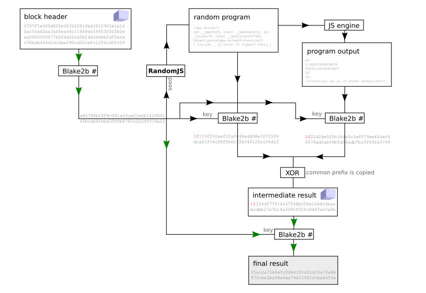

### Note: RandomJS is obsolete. Development continues at [RandomX](https://github.com/tevador/RandomX).

# RandomJS
This is a concept implementation of a proof-of-work (PoW) algorithm proposal for Monero (but it's usable for any PoW cryptocurrency). Credits to @hyc for the original idea to use random javascript execution to achieve ASIC resistance.

### Key features
* __ASIC resistant__. This is important for a decentralized cryptocurrency and allows anyone with an ordinary computer to participate in securing the network. The algorithm internally uses a Javascript engine, which is a large software package that can take advantage of CPU features such as branch prediction, caching and out-of-order execution. Full hardware implementation would require an enormous investment.
* __Asymmetrical__. The algorithm supports configurable asymmetry. Finding a single solution takes 2<sup>N</sup> times more effort than verifying a valid solution. This is beneficial for mining pools by reducing their hardware requirements.
* __DoS resistant__. The algorithm stores an intermediate value in the block header, allowing quick verification whether the PoW meets the difficulty target. This requires just two Blake2b hash calculations (roughly 500 nanoseconds on a modern CPU). This is beneficial both for mining pools and network nodes in case someone wanted to flood them with invalid blocks.

## Algorithm description


### Cryptographic hash function
The primary general-purpose hash function used by RandomJS is Blake2b with output size of 256 bits. This hash function was chosen for 3 primary reasons:

1. __Security.__ Security margin of Blake2b is comparable to the SHA-3 hash function.
1. __Speed.__ Blake2b was specifically designed to be fast in software, especially on modern 64-bit processors, where it's around three times faster than SHA-3.
1. __Built-in keyed mode.__ RandomJS requires both a plain hash function and a keyed hash function.

In the description below, `Blake2b(X)` and `Blake2b(K,X)` refer to the plain and keyed variant of Blake2b, respectively (both with 256-bit output length). `N >= 0` is a configurable parameter.

### Mining algorithm
1. Get a block header `H`.
1. Calculate `K = Blake2b(H)`.
1. Generate a random Javascript program `P` using `K` as the seed.
1. Calculate `A = Blake2b(K, P)`.
1. Execute program `P` and capture its output `Q`.
1. Calculate `B = Blake2b(K, Q)`.
1. If the leftmost N bits of `A` and `B` differ, go back to step 1.
1. Clear N leftmost bits of `B`.
1. Calculate `R = (A XOR B)`.
1. Calculate `PoW = Blake2b(K, R)`.
1. If `PoW` doesn't meet the difficulty target, go back to step 1.
1. Submit `H, R` as the result to be included in the block.

Finding and verifying a solution takes on average 3×2<sup>N</sup>+1 Blake2b hash calculations, 2<sup>N</sup> random javascript program generations and 2<sup>N</sup> javascript executions.

### Verification algorithm
Input: `H, R` from the received block.
1. Calculate `K = Blake2b(H)`.
1. Calculate `PoW = Blake2b(K, R)`.
1. If `PoW` doesn't meet the difficulty target, _discard the block_.
1. Generate a random Javascript program `P` using `K` as the seed.
1. Calculate `A = Blake2b(K, P)`.
1. If the N leftmost bits of `A` and `R` differ, _discard the block_.
1. Clear the N leftmost bits of `A`.
1. Execute program `P` and capture its output `Q`.
1. Calculate `B = Blake2b(K, Q)`.
1. If `R != (A XOR B)`, _discard the block_.

Verifying a valid solution requires 4 Blake2b hash calculations, one random program generation and one javascript execution.

In case of an DoS attack attempt, just 2 Blake2b hash calculations are required to discard the block. Otherwise an attacker needs to calculate substantial number of Blake2b hashes (equal to the current block difficulty) to force the verifying party to run the relatively costly (~few milliseconds) javascript generation and execution procedure.

### RandomJS generator
The generator is documented in [generator.md](doc/generator.md).

### JS Engine
RandomJS is currently using the [XS engine](https://github.com/tevador/moddable), which is a small and efficient implementatation developed for use in embedded devices.

## Build dependencies and instructions
See [build.md](doc/build.md).

## Donations
Support the development of RandomJS by donating.

XMR:
```
4B9nWtGhZfAWsTxWujPDGoWfVpJvADxkxJJTmMQp3zk98n8PdLkEKXA5g7FEUjB8JPPHdP959WDWMem3FPDTK2JUU1UbVHo
```
